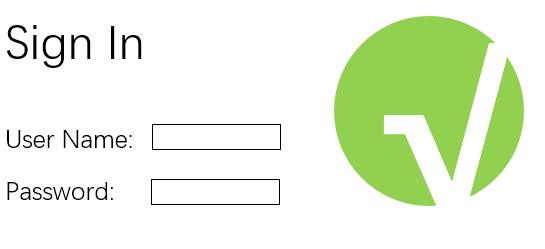
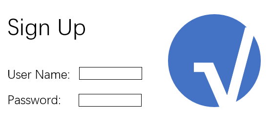
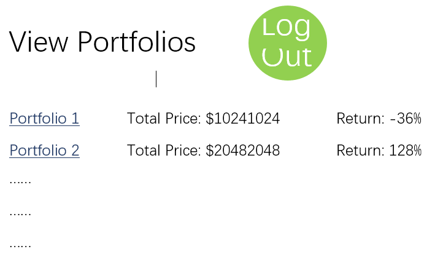
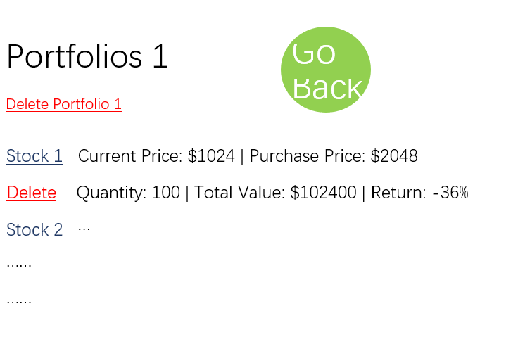
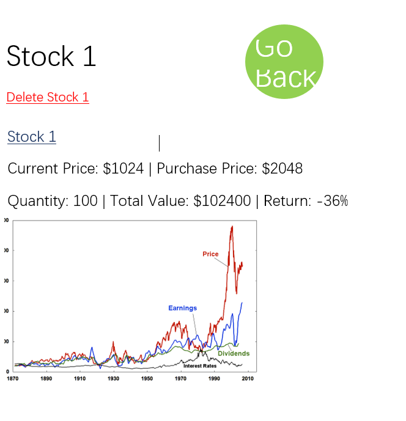
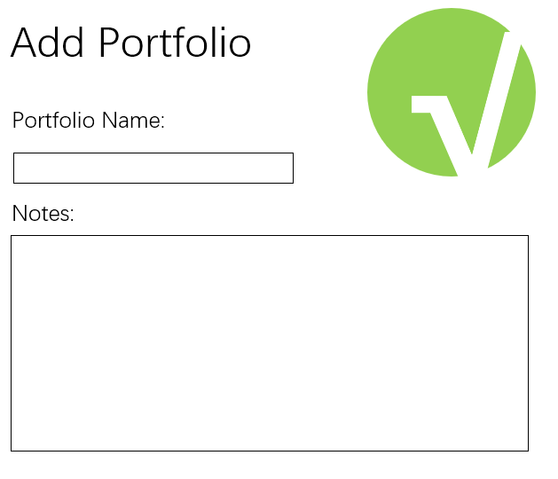
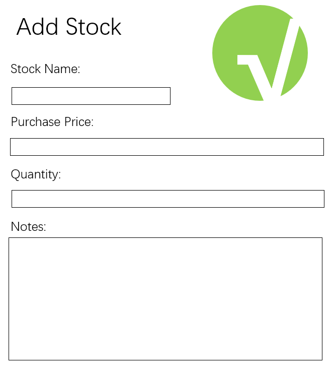
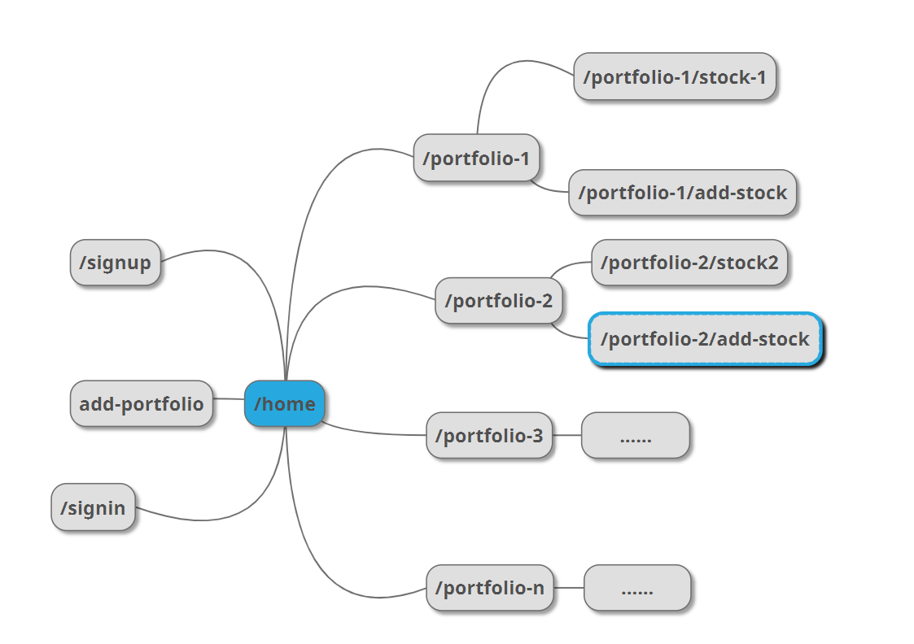

Stock Tracker

## Overview

Checking the stock price and calculating the return is teadious for a human brain, but a computer brain can handle it fast and accurately.

Stock Tracker is a web app which tracks your stock portfolio and caculate the return. Your can also get a detialed view of the performance of each stock in your porfolio. This web app may use an API to get data of the stocks, or it may use a script to get stock data from finance sites.


## Data Model

The application will store Users, Portfolios of stocks, Name of stocks, Quantity of stocks, Orininal Price, and Current Price.

* users can have multiple portfolios of stocks
* each portfolio have multiple stocks (Embedded)

An Example User:

```javascript
{
  username: "dumbInvestor",
  hash: // a password hash,
  portfolios: // an array of references to the portfolios
}
```

An Example Portfolio with Embedded Items:

```javascript
{
  user: // a reference to a User object
  portfolioName: "A Stupid Portfolio",
  portfolioItems: [
    { name: "AAPL", quantity: "100", original: "200", current: "160"},
    { name: "TESLA", quantity: "1000", original: "100", current: "300"},
  ],
  createdAt: // timestamp
}
```


## [Link to Commented First Draft Schema](src/db.js) 


## Wireframes

/signin - page for signing in



/signup - page for signing up



/home - page for showing overview of portfolios



/portfolio-1 - page for showing detail of a portfolio



/portfolio-1/stock-1 - page for showing detail of a stock



/add-portfolio - page for adding portfolios



/portfolio-1/add-stock - page for adding stock




## Site map



## User Stories or Use Cases

1. as non-registered user, I can register a new account with the site
2. as a user, I can log in to the site
3. as a user, I can create a new portfolio
4. as a user, I can delete portfolio
5. as a user, I can have a overview of the value and the return of all portfolios
6. as a user, I can have a overview of the stocks in a portfolio
7. as a user, I can add a new stock to a portfolio
8. as a user, I can delete stocks from portfolios
9. as a user, I can view the detail of every stock
6. as a user, I can logout of the web app

## Research Topics

* (5 points) Automated functional testing for all of your routes using any of the following
    * I'm going to use selenium for testing. Maybe I'll also use it to fetch data from the finance sites if I can't find a good API.
* (5 points) Integrate user authentication
    * I'm going to be using sign up and registration
    * I'm going to offer an option to link the account to google account
* (2 points) Use a CSS framework throughout your site, use a reasonable of customization of the framework (don't just use stock Bootstrap - minimally configure a theme):
    * I'm going to use a CSS framework (maybe modify Bootstrap)
* (1 - 6 points) Per external API used
    * I'm going to use a API for getting the stock data and doing the basic analysis
* (1 - 6 points) Use a client-side JavaScript library or module that we did not cover in class
    * I'm going to use angular or reactjs
* (4 points) Perform client side form validation using a JavaScript library
    * see <code>cs.nyu.edu/~jversoza/ait-final/my-form</code>
    * if you put in a number that's greater than 5, an error message will appear in the dom
* (5 points) vue.js
    * used vue.js as the frontend framework; it's a challenging library to learn, so I've assigned it 5 points
* (1 - 6 points) Use a server-side JavaScript library or module that we did not cover in class
    * maybe I'll use selenium to fetch data from other sites
    * I'll use a data visualization library to present my data

## [Link to Initial Main Project File](src/app.js) 

## Annotations / References Used

1. [MDN Web Docs](https://developer.mozilla.org/en-US/)
2. to be decided
