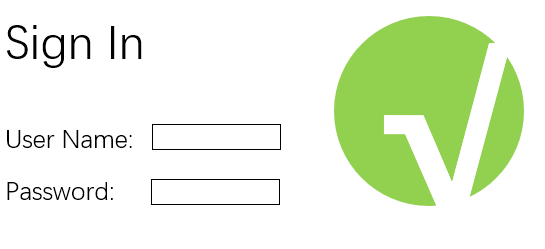
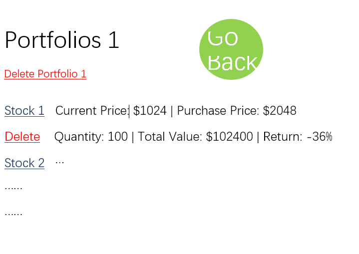

Stock Tracker

## Overview

Checking the stock price and calculating the return is teadious for a human brain, but a computer brain can handle it fast and accurately.

Stock Tracker is a web app which tracks your stock portfolio and caculate the return. Your can also get a detialed view of the performance of each stock in your porfolio. This web app may use an API to get data of the stocks, or it may use a script to get stock data from finance sites.


## Data Model

The application will store Users, Portfolios of stocks, Name of stocks, Quantity of stocks, Orininal Price, and Current Price.

* users can have multiple portfolios of stocks
* each portfolio have multiple stocks (Embedded)

An Example User:

```javascript
{
  username: "dumbInvestor",
  hash: // a password hash,
  portfolios: // an array of references to the portfolios
}
```

An Example Portfolio with Embedded Items:

```javascript
{
  user: // a reference to a User object
  portfolioName: "A Stupid Portfolio",
  portfolioItems: [
    { name: "AAPL", quantity: "100", original: "200", current: "160"},
    { name: "TESLA", quantity: "1000", original: "100", current: "300"},
  ],
  createdAt: // timestamp
}
```


## [Link to Commented First Draft Schema](src/db.js) 


## Wireframes

/signin - page for signing in



/signup - page for signing up


/home - page for showing overview of portfolios


/portfolio-1 - page for showing detail of a portfolio



/portfolio-1/stock-1 - page for showing detail of a stock


## Site map

(___TODO__: draw out a site map that shows how pages are related to each other_)

Here's a [complex example from wikipedia](https://upload.wikimedia.org/wikipedia/commons/2/20/Sitemap_google.jpg), but you can create one without the screenshots, drop shadows, etc. ... just names of pages and where they flow to.

## User Stories or Use Cases

(___TODO__: write out how your application will be used through [user stories](http://en.wikipedia.org/wiki/User_story#Format) and / or [use cases](https://www.mongodb.com/download-center?jmp=docs&_ga=1.47552679.1838903181.1489282706#previous)_)

1. as non-registered user, I can register a new account with the site
2. as a user, I can log in to the site
3. as a user, I can create a new grocery list
4. as a user, I can view all of the grocery lists I've created in a single list
5. as a user, I can add items to an existing grocery list
6. as a user, I can cross off items in an existing grocery list

## Research Topics

(___TODO__: the research topics that you're planning on working on along with their point values... and the total points of research topics listed_)

* (5 points) Integrate user authentication
    * I'm going to be using passport for user authentication
    * And account has been made for testing; I'll email you the password
    * see <code>cs.nyu.edu/~jversoza/ait-final/register</code> for register page
    * see <code>cs.nyu.edu/~jversoza/ait-final/login</code> for login page
* (4 points) Perform client side form validation using a JavaScript library
    * see <code>cs.nyu.edu/~jversoza/ait-final/my-form</code>
    * if you put in a number that's greater than 5, an error message will appear in the dom
* (5 points) vue.js
    * used vue.js as the frontend framework; it's a challenging library to learn, so I've assigned it 5 points

10 points total out of 8 required points (___TODO__: addtional points will __not__ count for extra credit_)


## [Link to Initial Main Project File](app.js) 

(___TODO__: create a skeleton Express application with a package.json, app.js, views folder, etc. ... and link to your initial app.js_)

## Annotations / References Used

(___TODO__: list any tutorials/references/etc. that you've based your code off of_)

1. [passport.js authentication docs](http://passportjs.org/docs) - (add link to source code that was based on this)
2. [tutorial on vue.js](https://vuejs.org/v2/guide/) - (add link to source code that was based on this)
